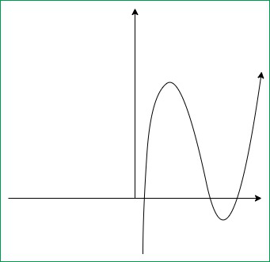

# Support Vector Machine

## What is SVM?

SVM is a machine learning algorithm that uses supervised learning models to solve complex classification, regression, and outlier detection problems by performing optimal data transformations that determine boundaries between data points based on predefined classes, labels, or outputs.

Technically speaking, the primary objective of SVM is to identify a `hyperplane` that distinguishably segregates the data points of different classes. In geometry, `hyperplane` is a subspace whose dimension is one less than that of its ambient space. For example, if a space is 3-dimensional then its hyperplanes are the 2-dimensional planes, while if the space is 2-dimensional, its hyperplanes are the 1-dimensional lines. The best hyperplane for a SVM means the one with the largest `margin` between the two classes, where `margin` means the maximal width of the slab parallel to the hyperplane that has no interior data points.

The `support vectors` are the data points that are closest to the separating hyperplane. These points are on the boundary of the slab. The following figure illustrates these definitions, with "+" indicating data points of type 1 and "-" indicating data points of type -1.

## Types of SVM

SVMs are broadly classified into two types: `simple or linear SVM` and `kernel or non-linear SVM`.

|**Linear SVM** | **Non-linear SVM**|
|   -  |  - |
|It can be easily separated with a linear line/hyperplane|It cannot be easily separated with a linear line/hyperplane|
|Data is classified with the help of linear line/hyperplane|We use Kernels to make non-separable data into separable data|
|Data can be easily classified by drawing a straight line/hyperplane|We map data into high dimensional space to classify|

### Linear SVM

Linear SVM refers to the SVM type used for classifying linearly separable data. This implies that when a dataset can be segregated into categories or classes with the help of a single straight line, it is termed a linear SVM, and the data is referred to as linearly distinct/separable.

Equation of hyperplane

$$
\begin{aligned}
    H: w^Tx + b = 0
\end{aligned}
$$

Where:
* b - intercept and bias term of the hyperplane equation
* w - the normal vector of the hyperplane

The two cases can be defined as:

$$
\begin{aligned}
    w^Tx_i + b < 0 \ if \ y_i = -1 \\
    w^Tx_i + b > 0 \ if \ y_i = +1 \\
    y_i * (w^Tx_i + b) > 0
\end{aligned}
$$

The distance from a given data point to the hyperplane:

$$
\begin{aligned}
\gamma_i = \frac{y_i(w^Tx_i + b)}{\lVert w \rVert}
\end{aligned}
$$

We define the margin of the linear classifier as the minimum distance of a point from the separating hyperplane: 

$$
\begin{aligned}
\gamma_i^* = min_{x_i}\frac{y_i(w^Tx_i + b)}{\lVert w \rVert} = \frac{y_i^*(w^Tx_i^* + b)}{\lVert w \rVert}
\end{aligned}
$$

Hard margin classifier:

$$
\begin{aligned}
Objective\ function: min_{w, b} \frac{\lVert w \rVert^2}{2} \\
s.t.: y_i(w^Tx_i + b) \geq 1
\end{aligned}
$$

Soft margin classifier:

$$
\begin{aligned}
Objective\ function: min_{w, b} [\frac{\lVert w \rVert^2}{2} + C\sum_i^n \epsilon_i^k] \\
s.t.: y_i(w^Tx_i + b) \geq 1 - \epsilon_i,\ where\ \epsilon_i \geq 0
\end{aligned}
$$

Where C an k are constants for balancing the cost of misclassification. If k=1 then loss is named as `Hinge Loss` and if k=2 then it's called `Quadratic Loss`. For example, the figure below displays the hinge loss function($\lambda_i$ represents $w^Tx_i + b$).

In this case, we can change the inequality constraint to equality constraint by rewritting the equation $y_i(w^Tx_i + b) \geq 1 - \epsilon_i$ in the following way:

$$
\begin{aligned}
\epsilon_i = max(0, 1 - y_i(w^Tx_i + b))
\end{aligned}
$$

Loss function could be written as:

$$
\begin{aligned}
L = \frac{||w||^2}{2} + C\sum_i^n max(0, 1 - y_i(w^Tx_i + b))
\end{aligned}
$$

### Nonlinear SVM

With what we have been explained so far, data sets that are linearly separable (perhaps with a few exceptions or some noise) are well-handled. But what are we going to do is the dataset doesn't allow classification by a linear classifier? 

Let's look at a one-dimensional case. The top dataset in the figure below is straightforwardly classified by a linear classifier but the middle dataset is not. We instead need to be able to pick out an interval. One way to solve this problem is to map the data into a higher dimensional space and then to use a linear classifier in the higher dimensional space. For example, the bottom part of the figure shows that a linear separator can classify the data if we use a quadratic function to map the data into two dimensions. 

The general idea here is to map the original feature space to some higher-dimensional feature space where the training set is separable. Of course, we would want to do so in ways that preserve relevant dimensions of relatedness between the data points, so that the resultant classifier should still generalize well.

[Image source](https://nlp.stanford.edu/IR-book/html/htmledition/nonlinear-svms-1.html)

SVMs provide an easy and efficient way of doing this mapping to a higher dimensional space, which is referred to as `kernel trick`. It is not really a trick, it just exploits the math we have seen. The SVM Kernel classifier relies on a dot product between data points. 

Let $K(\vec{x_i}, \vec{x_j})$ = $\vec{x_i}^T\vec{x_j}$, then the dual form of classifier could be rewritten as:

$$
\begin{aligned}
f(\vec{x})=\operatorname{sign}\left(\sum_i \alpha_i y_i K\left(\vec{x}_i, \vec{x}\right)+b\right)
\end{aligned}
$$

Now suppose we decide to map each data point to a higher dimensional space via some transformation $\phi: x \rightarrow \phi(x)$. Then the dot produce becomes $\phi(x_i)^T\phi(x_j)$. If it turned out that this dot product could be computed simply and efficiently in terms of the original data points, then we wouldn't have to actually map from $x \rightarrow \phi(x)$. Rather, we could simply compute the quantity $K\left(\vec{x}_i, \vec{x}_j\right)=\phi\left(\vec{x}_i\right)^T \phi\left(\vec{x}_j\right)$ and then use the function's value in the equation above.

Example: Quadratic Kernel

For 2-dimensional vectors 

$$
\begin{aligned}
\vec{u}=\left(\begin{array}{ll}u_1 & u_2\end{array}\right)\\
\vec{v}=\left(\begin{array}{ll}v_1 & v_2\end{array}\right)\\
\end{aligned}
$$

, consider 
$K(\vec{u}, \vec{v})=\left(1+\vec{u}^T \vec{v}\right)^2$
. We wish to show that this is a kernel, i.e., that 
$K(\vec{u}, \vec{v})=\phi(\vec{u})^T \phi(\vec{v})$ for some $\phi$. 

Consider $\phi(u) = (1, u_1^2, \sqrt{2}u_1u_2, u_2^2, \sqrt{2}u_1, \sqrt{2}u_2)$. Then:

$K(\vec{u}, \vec{v})=\left(1+\vec{u}^T \vec{v}\right)^2$ = $1+u_1^2 v_1^2+2 u_1 v_1 u_2 v_2+u_2^2 v_2^2+2 u_1 v_1+2 u_2 v_2 = (1, u_1^2, \sqrt{2}u_1u_2, u_2^2, \sqrt{2}u_1, \sqrt{2}u_2)^T (1, v_1^2, \sqrt{2}v_1v_2, v_2^2, \sqrt{2}v_1, \sqrt{2}v_2)=\phi(\vec{u})^T \phi(\vec{v})$

Examples of SVM kernels:

* Polynomial kernel (e.g., image processing): $k\left(\mathbf{x}_{\mathbf{i}}, \mathbf{x}_{\mathbf{j}}\right)=\left(\mathbf{x}_{\mathbf{i}} \cdot \mathbf{x}_{\mathbf{j}}+1\right)^d<$, where d is the degree of the polynomial

* Gaussian kernel (general-purpose kernel, used when there is no prior knowledge about the data): $k(x, y)=\exp \left(-\frac{\|x-y\|^2}{2 \sigma^2}\right)$

* Gaussian radial basis function (RBF, general-purpose kernel): $k\left(\mathbf{x}_{\mathbf{i}}, \mathbf{x}_{\mathbf{j}}\right)=\exp \left(-\gamma\left\|\mathbf{x}_{\mathbf{i}}-\mathbf{x}_{\mathbf{j}}\right\|^2\right)$ for $\gamma > 0$

* Laplace RBF kernel (general-purpose kernel): $k(x, y)=\exp \left(-\frac{\|x-y\|}{\sigma}\right)$

* Hyperbolic tangent kernel (used in neural networks): $k\left(\mathbf{x}_{\mathbf{i}}, \mathbf{x}_{\mathbf{j}}\right)=\tanh \left(\kappa \mathbf{x}_{\mathbf{i}} \cdot \mathbf{x}_{\mathbf{j}}+c\right)$

* Sigmoid kernel (used as the proxy for neural networks): $k(x, y)=\tanh \left(\alpha x^T y+c\right)$

* ANOVA RBF (used in regression problems): $k(x, y)=\sum_{k=1}^n \exp \left(-\sigma\left(x^k-y^k\right)^2\right)^d$

* Linear splines kernel in one-dimension (used when dealing with large sparse data vectors, often applied in text categorization and regression problems): $k(x, y)=1+x y+x y \min (x, y)-\frac{x+y}{2} \min (x, y)^2+\frac{1}{3} \min (x, y)^3$

### Pros and Cons of SVMs

Pros:

* Accuracy
* Works well on smaller cleaner dataset
* It can be more efficient because it uses a subset of training points

Cons:

* Isn't suited for larger datasets as the training time with SVMs can be high
* Less effective on noisier datasets with overlapping classes

### Usecases

* Text categorization & handwriting recognition
* Speech recognition
* Spam detection
* Sentiment analysis